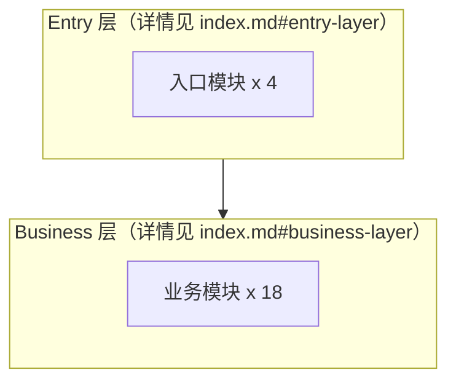

# 执行约束与边界场景

> 当需要具体执行 SOP-1 / SOP-2 时读取此文档。目标：保证 Wiki 生成与增量更新高效、稳定、可恢复。

## 性能策略

| 策略 | 说明 |
|------|------|
| 浅扫描优先 | 步骤 2 只 Glob 目录结构，不读全量源码 |
| 入口文件法 | 优先读 `index.ts` / `mod.rs` / `__init__.py` |
| Grep 替代 AST | 默认用 Grep/正则提取依赖，不做完整语法分析 |
| 动态分层 | 按项目规模决定深度节点与轻量节点比例 |
| 增量更新 | 优先使用 `.wiki-state.json` 和 Git 变更缩小范围 |
| 深度限制 | 目录扫描默认深度 2-3 层 |
| 并行写入 | 节点文件必须并行写入，禁止逐个串行 |
| 分批上限 | 单轮最多 8 个文件并行写入 |
| 轻量节点精简 | 轻量节点只保留 frontmatter + 概述，控制在 15 行内 |

## 执行顺序

### 阶段 A：扫描分析

1. 项目类型检测
2. 核心模块扫描
3. 依赖关系提取

### 阶段 B：批量生成

1. 并行写入节点文件（每批 <= 8）
2. 写入 `index.md`
3. 写入 `index.json`
4. 写入 `glossary.md`
5. 写入 `.wiki-state.json`

> 节点文件与索引文件应在同一批或相邻两批内完成，避免状态不一致。

### 阶段 C：收尾

1. 如有 `CLAUDE.md`，追加 Wiki 规则
2. 输出结果摘要

---

## 阶段 A：扫描中间产物 Schema

阶段 A 的三步（项目检测、模块扫描、依赖分析）之间通过 **内存中的统一结构** 传递数据。如执行中断，可序列化为 `wiki/.wiki-scan-cache.json` 以支持断点恢复。

```jsonc
{
  "project": {
    "name": "string",
    "type": "string",              // node / taro-miniprogram / java-maven 等
    "language": "string",
    "entry_file": "string",
    "monorepo": false,
    "source_root": "string",
    "framework": "string"          // 仅 Taro / 跨端项目填写
  },
  "modules": [
    {
      "id": "page.checkout",       // 稳定语义 ID
      "slug": "string",
      "type": "page|component|api|hook|store|util|...",
      "path": "string",
      "entry_file": "string",
      "files": ["string"],
      "score": 0.85,
      "coverage": "deep|light",
      "exports": ["string"],       // 深度节点才填
      "aliases": ["string"],
      "tags": ["string"]
    }
  ],
  "edges": {
    "import": [
      { "from": "id_a", "to": "id_b" }
    ],
    "route": [
      { "from": "id_a", "to": "id_b", "method": "router.push|Link|Taro.navigateTo", "route_type": "internal|internal-dynamic|external" }
    ],
    "dynamic": [
      { "from": "id_a", "to": "id_b" }
    ]
  },
  "inbound": {
    "id_a": { "import_in": 3, "route_in": 5 }
  }
}
```

**约束**：
- 阶段 B 只能从上述结构产出节点/索引文件，不得再次触发源码扫描
- 若步骤 3（依赖分析）中遇到某模块无法解析，仅将该模块 `coverage` 降为 `light` 并标记 `confidence: low`，不影响其他模块进入阶段 B

---

## 阶段 B：节点写入执行策略

### 先收集后批量写入

1. 阶段 A 完成后，在内存中准备好所有节点的内容
2. **一次响应中发起所有 Write 调用**（Claude Code 支持单消息多工具并行调用）
3. 分批上限：单轮最多并行写入 **8 个文件**。超过 8 个分 2-3 轮写入，每轮完成立即进入下一轮

### 深度节点正文结构（7 章节，严格顺序）

1. **概述** — 一句话描述模块职责
2. **快速定位** — `aliases` / `tags` / `key_files` / `related_paths`
3. **公开接口** — 导出的函数/类/方法表格
4. **依赖关系** — 邻域图 + 上下游表格，每个 `[[id]]` 链接附用途说明
5. **关键文件** — 重要文件列表及其角色
6. **设计决策** — 可从注释/文档推断的设计选择
7. **历史包袱 (Legacy Constraints)** — 初始为空，由 SOP-2 填充

### 轻量节点正文结构（2 章节，≤15 行）

1. **概述** — 一句话描述
2. **文件列表** — 仅列出文件名，不分析内容

### 稳定 ID 规则

- 必须是语义 ID：`page.checkout`、`module.order-service`、`foundation.shared-request`
- **禁止使用时间戳**（如 `20260413-143053`）
- 首次生成后写入 `.wiki-state.json` 持久化
- 后续 `scan` / `refresh` / 路径迁移时应尽量复用原 `id`
- 路径迁移时，将旧路径写入 `previous_paths`，保留原 `id` 不变

---

## 阶段 B：Mermaid 图谱生成规则

### 基础命名规则

- Mermaid 内部节点名使用对稳定 ID 的安全化形式：`page.checkout` → `page_checkout`（点号替换为下划线，避免语法冲突）
- 节点标签格式：`("名称<br/><small>路径</small>")`，兼顾可读性与定位
- 循环依赖用红色粗线标注：`A =="循环"==> B`

### 规模降级策略

| 深度节点数 | 依赖关系图渲染策略 |
|-----------|-----------------|
| ≤ 15 | 全部渲染，含轻量节点 |
| 16 – 30 | 只渲染深度节点，轻量节点在图下方以列表形式附录 |
| 31 – 60 | 按 `layer` 切分为 4 张子图：Entry / Business / UI / Foundation；主图只画层间关系，不画具体模块 |
| > 60 | 主图仅保留层间关系；各层细节放到对应 layer 的独立文档或独立 `.md` 附录；不强制渲染全量依赖图 |

### 子图切分示例（深度节点 31-60 档位）



在 `index.md` 中为每个 layer 生成对应锚点，展开子图。

---

## 阶段 C：冲突合并策略（用户手改保护）

用户可能在 `scan` / `refresh` 之间手动编辑了节点文件（补充业务说明、修正 exports、添加自定义章节等）。增量更新必须保留这些手改内容，不得被覆盖。

### 三类需保留的内容

| 类型 | 识别方式 | 保留策略 |
|------|---------|---------|
| **历史包袱章节** | `## 历史包袱 (Legacy Constraints)` | 整段保留，只追加不覆盖 |
| **用户自定义章节** | 不在 7 章节模板内的 `##` 标题（如 `## 业务说明`、`## 排期备忘`） | 整段保留，置于原位置之后 |
| **字段级补注** | 在模板字段值尾部追加的注释（如 `aliases: [a, b]  # 用户补充` 的 `#` 后内容） | 保留注释 |

### 执行流程（scan / node update / refresh 公用）

1. **读取旧节点**：解析 frontmatter + 正文章节结构
2. **生成新内容**：按阶段 A/B 产生 frontmatter 与标准 7 章节
3. **合并**：
   - frontmatter：新字段覆盖旧字段；对用户补注的 `#` 注释，优先保留
   - 标准章节（1-6）：用新内容覆盖
   - 历史包袱章节（7）：从旧文件整段复制到新文件
   - 自定义章节：从旧文件按出现顺序附加到标准 7 章节之后
4. **写入**：并行写入合并后的节点文件

### 无法匹配时的兜底

- 如新节点 ID 与旧节点 ID 不一致（路径迁移且 ID 未复用），将旧文件中的历史包袱与自定义章节写入 `index.md` 的 **孤立内容** 章节，提示用户人工确认
- 自定义章节超过 5 个时，提示用户确认是否需要拆分为独立节点

---

## 一致性要求

- `scan` 后必须同步刷新 `index.md`、`index.json`、`.wiki-state.json`
- `refresh` 后必须优先按稳定 `id` 回写历史包袱与用户自定义章节
- 无法确认的节点必须标记 `freshness: stale` 或 `confidence: low`

## 边界场景

| 场景 | 处理方式 |
|------|---------|
| 空项目 | 创建 `index.md` / `index.json`，标记项目为空 |
| 超大 Monorepo（>50 子包） | 让用户选择 1-3 个子包聚焦处理 |
| 无法识别项目类型 | 询问语言、源码目录、关注范围 |
| `wiki/` 已存在 | 询问增量更新 / 全量重建 / 取消 |
| 无法读取的文件 | 跳过，并将节点标记为 `confidence: low` |
| 候选模块过多 | 让用户选择深度扫描范围，其余创建轻量节点 |
| 用户手改节点后 scan | 按「冲突合并策略」执行，保留历史包袱与自定义章节 |
