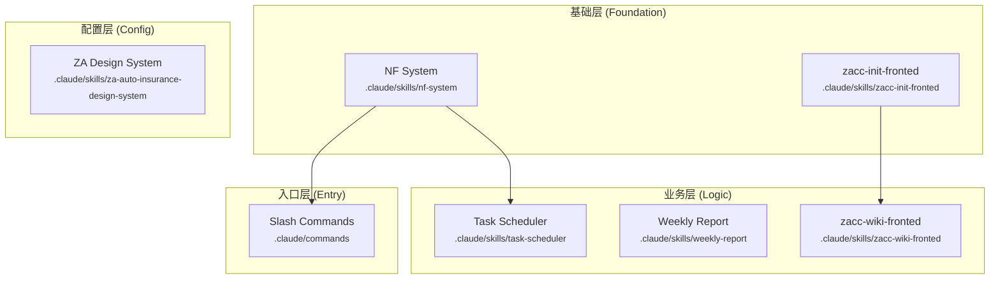
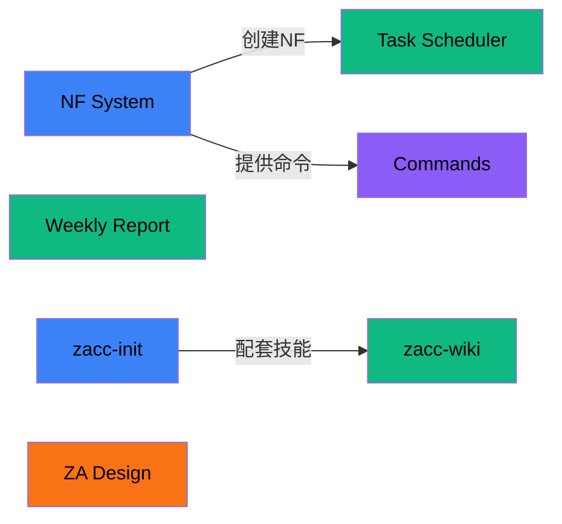

# 项目拓扑 Wiki — claude_skills

> **Claude Skills 仓库** — 包含多个可复用的技能包，用于增强 Claude Code 的能力。

---

## 概念层次图 (Concept Hierarchy)



---

## 模块依赖关系图 (Entity Relationship Graph)



---

## 依赖热力矩阵

| 调用者 ↓ \ 被调用者 → | NF System | Task Scheduler | Weekly Report | zacc-init | zacc-wiki | ZA Design | Commands |
|----------------------|-----------|----------------|---------------|-----------|-----------|-----------|----------|
| **NF System** | - | | | | | | |
| **Task Scheduler** | ● | - | | | | | |
| **Weekly Report** | | | - | | | | |
| **zacc-init-fronted** | | | | - | | | |
| **zacc-wiki-fronted** | | | | ● | - | | |
| **ZA Design System** | | | | | | - | |
| **Slash Commands** | ● | | | | | | - |

**入度统计（被依赖数）：**
- NF System: 2 ⭐ 核心枢纽
- zacc-init-fronted: 1
- 其他: 0

---

## 分层架构视图

```
claude_skills/
├── 入口层
│   └── Slash Commands (.claude/commands/)
│       └── nf-*, weekly-report
│
├── 业务层
│   ├── Task Scheduler — 多任务并发调度
│   ├── Weekly Report — 周报生成器
│   └── zacc-wiki-fronted — Wiki 拓扑生成
│
├── 基础层
│   ├── NF System — NF 开发系统 ⭐
│   └── zacc-init-fronted — 前端初始化
│
└── 配置层
    └── ZA Design System — 设计规范
```

---

## 模块关系总表

| ID | 名称 | 类型 | 路径 | 上游 | 下游 | 入度 | 出度 | 状态 |
|----|------|------|------|------|------|------|------|------|
| 20260416-143052 | NF System | foundation | .claude/skills/nf-system | - | Task Scheduler, Commands | 2 | 0 | active |
| 20260416-143053 | Task Scheduler | logic | .claude/skills/task-scheduler | NF System | - | 0 | 1 | active |
| 20260416-143054 | Weekly Report | logic | .claude/skills/weekly-report | - | - | 0 | 0 | active |
| 20260416-143055 | zacc-init-fronted | foundation | .claude/skills/zacc-init-fronted | - | zacc-wiki | 1 | 0 | active |
| 20260416-143056 | zacc-wiki-fronted | logic | .claude/skills/zacc-wiki-fronted | zacc-init | - | 0 | 1 | active |
| 20260416-143057 | ZA Design System | config | .claude/skills/za-auto-insurance-design-system | - | - | 0 | 0 | active |
| 20260416-143058 | Slash Commands | module | .claude/commands | NF System | - | 0 | 1 | active |

---

## 快速导航

### 按类型分组

| 类型 | 模块 |
|------|------|
| **foundation** | NF System, zacc-init-fronted |
| **logic** | Task Scheduler, Weekly Report, zacc-wiki-fronted |
| **config** | ZA Design System |
| **module** | Slash Commands |

### 核心枢纽模块（入度 >= 2）

- **NF System** — 被 2 个模块依赖，修改需评估全局影响

### 有历史包袱的节点

（暂无）

---

## 使用指南

### 触发方式

使用技能 **`zacc-wiki-fronted`** + 自然语言，或斜杠命令 **`/zacc-wiki-fronted`**：
- 初始化：首次生成 `.wiki/`
- 查询：架构感知问答
- 增量更新：scan / legacy / node add/deprecate/update / refresh

### 文件位置

- Wiki 索引：`.wiki/index.md`（本文件）
- Wiki 节点：`.wiki/nodes/`
- 术语表：`.wiki/glossary.md`
