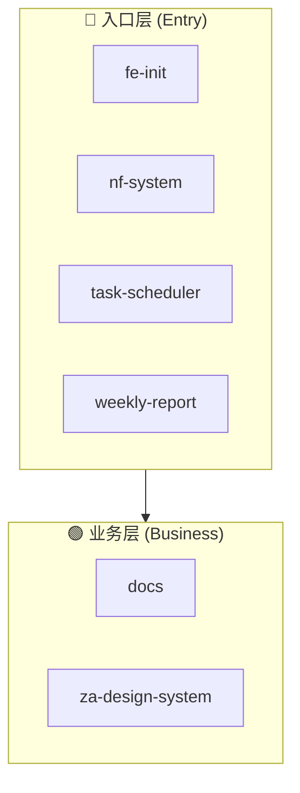
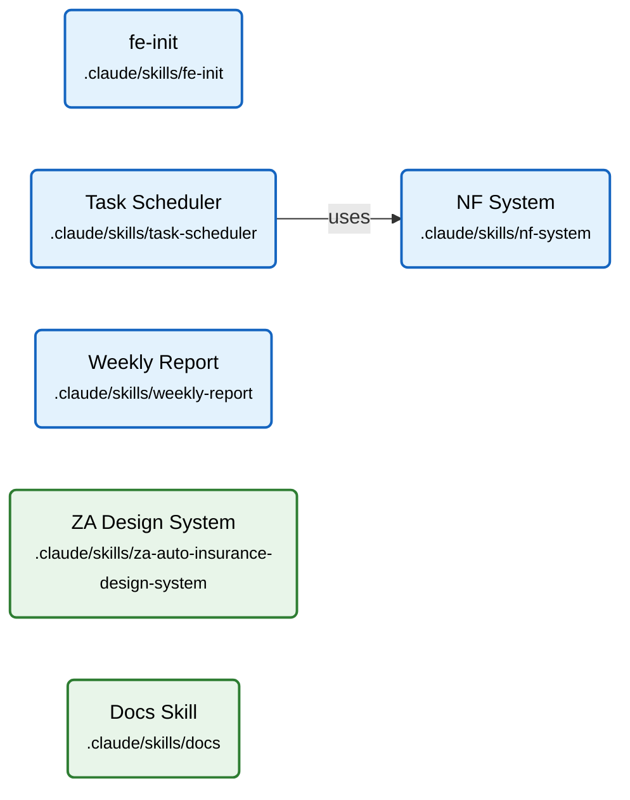

# claude_skills — 项目拓扑索引

> 此文件由 `/fe-init` 自动生成，是 AI 理解项目架构的入口。
> 修改任何模块前，**必须**先阅读此文件。

---

## 概念层次图 (Concept Hierarchy)

> 展示项目的分层架构：入口层 → 业务层 → 基础层。



---

## 模块依赖关系图 (Entity Relationship Graph)

> 展示模块间的真实依赖关系。



---

## 依赖热力矩阵 (Dependency Heatmap)

### Import 依赖矩阵

| 模块 ↓ import → | NF System | fe-init | Task Scheduler | Weekly Report | ZA Design | Docs | 出度 |
|----------------|:---------:|:-------:|:--------------:|:-------------:|:---------:|:----:|:----:|
| **NF System** | — | ◌ | ◌ | ◌ | ◌ | ◌ | 0 |
| **fe-init** | ◌ | — | ◌ | ◌ | ◌ | ◌ | 0 |
| **Task Scheduler** | ● | ◌ | — | ◌ | ◌ | ◌ | 1 |
| **Weekly Report** | ◌ | ◌ | ◌ | — | ◌ | ◌ | 0 |
| **ZA Design System** | ◌ | ◌ | ◌ | ◌ | — | ◌ | 0 |
| **Docs** | ◌ | ◌ | ◌ | ◌ | ◌ | — | 0 |
| **import_in** | 1 | 0 | 0 | 0 | 0 | 0 | — |

### 核心模块速查

| 模块 | import_in | 出度 | 分类 | 修改风险 |
|------|:---------:|:----:|------|---------|
| NF System | 1 | 0 | 核心技能 | 🟡 中 |
| fe-init | 0 | 0 | 独立技能 | 🟢 低 |
| Task Scheduler | 0 | 1 | 调度器 | 🟢 低 |
| Weekly Report | 0 | 0 | 独立技能 | 🟢 低 |
| ZA Design System | 0 | 0 | 设计规范 | 🟢 低 |
| Docs | 0 | 0 | 文档技能 | 🟢 低 |

---

## 分层架构视图 (Text)

```
claude_skills
│
├── 入口层 (Entry)
│   ├── nf-system → .wiki/nodes/20260416-nf-system.md
│   ├── fe-init → .wiki/nodes/20260416-fe-init.md
│   ├── task-scheduler → .wiki/nodes/20260416-task-scheduler.md
│   └── weekly-report → .wiki/nodes/20260416-weekly-report.md
│
└── 业务层 (Business)
    ├── za-design-system → .wiki/nodes/20260416-za-design-system.md
    └── docs → .wiki/nodes/20260416-docs.md
```

---

## 模块关系总表

| ID | 名称 | 类型 | 路径 | import_in | 出度 | 状态 |
|----|------|------|------|:---------:|:----:|------|
| 20260416-nf-system | NF System | module | .claude/skills/nf-system | 1 | 0 | active |
| 20260416-fe-init | fe-init | module | .claude/skills/fe-init | 0 | 0 | active |
| 20260416-task-scheduler | Task Scheduler | module | .claude/skills/task-scheduler | 0 | 1 | active |
| 20260416-weekly-report | Weekly Report | module | .claude/skills/weekly-report | 0 | 0 | active |
| 20260416-za-design-system | ZA Design System | module | .claude/skills/za-auto-insurance-design-system | 0 | 0 | active |
| 20260416-docs | Docs Skill | module | .claude/skills/docs | 0 | 0 | deprecated |

---

## 快速导航

### 按类型

**核心技能模块**：
- [NF System](nodes/20260416-nf-system.md) — New Feature 系统，驱动并行 Agent 开发
- [fe-init](nodes/20260416-fe-init.md) — 前端项目 AI 初始化

**调度与报告模块**：
- [Task Scheduler](nodes/20260416-task-scheduler.md) — 多任务并发调度器
- [Weekly Report](nodes/20260416-weekly-report.md) — 众安车险周报生成器

**业务支撑模块**：
- [ZA Design System](nodes/20260416-za-design-system.md) — 众安车险C端设计规范

**已废弃模块**：
- [Docs](nodes/20260416-docs.md) — ~~文档技能~~（实际为备份目录，已废弃）

### 核心枢纽模块

- [NF System](nodes/20260416-nf-system.md) — 被 Task Scheduler 依赖，是 NF 流程的核心

---

## 图谱生成说明

> **Mermaid 渲染**：上方图谱使用 Mermaid 语法。支持在 GitHub、VS Code、Obsidian 等环境中直接渲染。
>
> **图谱更新**：执行 `/fe-wiki-update scan` 或 `/fe-wiki-update refresh` 时会自动重新生成图谱。
