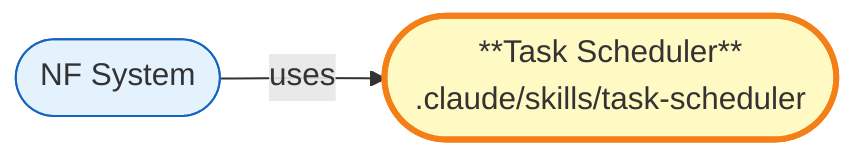

# Task Scheduler — 多任务并发调度器

## 概述

基于 Team 机制自动创建 NF 并管理多个 Agent 并发执行的技能包。

## 公开接口

| 名称 | 类型 | 签名 | 说明 |
|------|------|------|------|
| /task-scheduler | command | `/task-scheduler` | 启动多任务调度器 |

## 依赖关系

### 邻域图 (Neighborhood Graph)

### 入度摘要

| 指标 | 值 | 含义 |
|------|:--:|------|
| import_in | 0 | 独立技能包 |
| route_in | 0 | 非页面模块 |

## 关键文件

| 文件 | 角色 | 说明 |
|------|------|------|
| SKILL.md | 入口 | 技能定义 |
| templates/ | 模板 | 任务模板 |

## 设计决策

- 基于 Claude Code Team 机制
- 自动创建和管理 NF
- 支持多 Agent 并发执行
