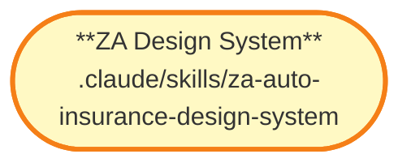

# ZA Auto Insurance Design System — 众安车险C端设计规范

## 概述

众安车险C端设计规范技能包，提供设计系统参考。

## 公开接口

| 名称 | 类型 | 说明 |
|------|------|------|
| za-auto-insurance-design-system | skill | 设计规范技能 |

## 依赖关系

### 邻域图 (Neighborhood Graph)

### 入度摘要

| 指标 | 值 | 含义 |
|------|:--:|------|
| import_in | 0 | 独立技能包 |
| route_in | 0 | 非页面模块 |

## 关键文件

| 文件 | 角色 | 说明 |
|------|------|------|
| SKILL.md | 入口 | 技能定义 |

## 设计决策

- 提供众安车险C端设计规范
- 支持设计决策参考
